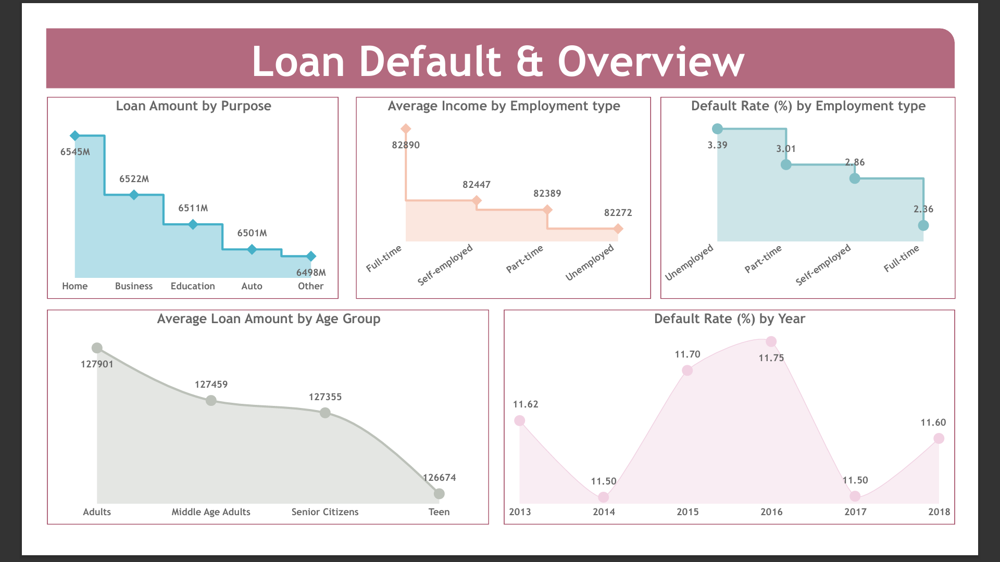
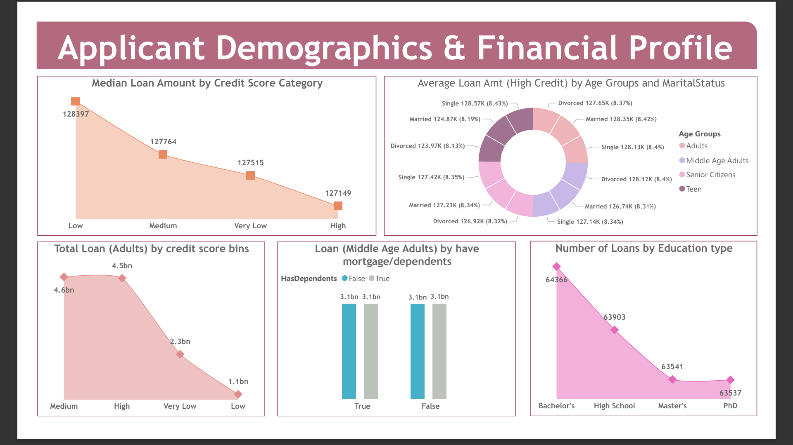
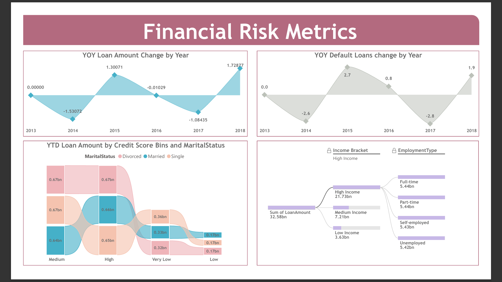

# 📊 Loan Risk Analysis (SQL + Power BI)

A data analysis project on loan default risk using ~26,000+ records. The project focuses on identifying high-risk borrower segments and analyzing how factors like income, credit score, employment type, and loan amount influence default behavior. Built using SQL for data processing and Power BI for interactive dashboarding.

---

## 📊 Dataset Information

- Records: ~26,000+ rows  
- Dataset: Loan Default Dataset  
- Tables used: 1 (loan_default)  
- Key features:
  - Income
  - Credit Score
  - Employment Type
  - Loan Amount
  - Age Group
  - Marital Status
  - Default Status (Target Variable)

---

## 🚀 Project Highlights

- Built an end-to-end pipeline: CSV → SQL Server → Power BI  
- Cleaned and transformed 26K+ records using SQL  
- Created calculated measures using DAX for KPIs like default rate and total loans  
- Designed 3 interactive dashboard pages:
  - Loan Overview  
  - Applicant Demographics & Financial Profile  
  - Financial Risk Metrics  
- Identified high-risk segments based on income, credit score, and employment type  

---

## 📌 Problem Statement

Loan defaults are a major challenge for financial institutions, leading to significant financial losses. 

This project analyzes borrower data (~26K+ records) to identify patterns that contribute to loan defaults. It focuses on understanding how factors like income, credit score, employment type, and demographics influence default risk, and provides insights to support better loan approval decisions.

---

## ⚙️ Tech Stack
- SQL (Data cleaning & transformation)
- Power BI (Dashboard & visualization)
- DAX (KPIs & calculations)
- Power Query (Data transformation)

---

## 📊 Dashboard Preview

### 🔹 Loan Overview


### 🔹 Applicant Analysis


### 🔹 Risk Metrics


---

## 📈 Key KPIs
- Total Loan Applications
- Default Rate
- Average Income
- Loan Amount Distribution
- Risk Segmentation

---

## 🎯 Business Impact

- Unemployed applicants show the highest default rate (~3.39%), which is ~1% higher than part-time applicants (~2.36%), indicating income instability as a key
  risk factor  
- Self-employed and full-time applicants have moderate default rates (~2.8%–3.0%), suggesting relatively stable but still significant risk  
- Variations in employment type contribute to measurable differences in default probability, supporting the need for risk-based segmentation in loan approval
- Default rates remain relatively stable between ~11.5%–11.7% across years, indicating persistent credit risk rather than short-term fluctuations  

---

## 🚀 Recommendations

- Implement stricter approval criteria for applicants with low income and poor credit history  
- Introduce risk-based interest rates for high-risk borrower segments  
- Prioritize full-time employed applicants with stable income profiles  
- Monitor and review loans issued to self-employed and part-time applicants more frequently  
- Use data-driven scoring models to support loan approval decisions  

---

```
## 📁 Project Structure

loan-risk-analysis-powerbi/
│
├── assets/
│ └── images/
│
├── data/
│
├── dax/
│
├── docs/
│
├── powerbi/
│
├── sql/
│
└── README.md

```

---

## 🧠 Key Learnings
- End-to-end data analysis workflow
- Data cleaning and transformation using SQL
- Building interactive dashboards in Power BI
- Using DAX for business metrics

---

## 📌 Future Improvements
- Implement machine learning model for risk prediction
- Add real-time data refresh
- Deploy dashboard to cloud

---

## 🧪 Key Questions Answered

- Which customer segments are most likely to default?
- How does income and employment type influence loan risk?
- What borrower profiles are safest for loan approval?
